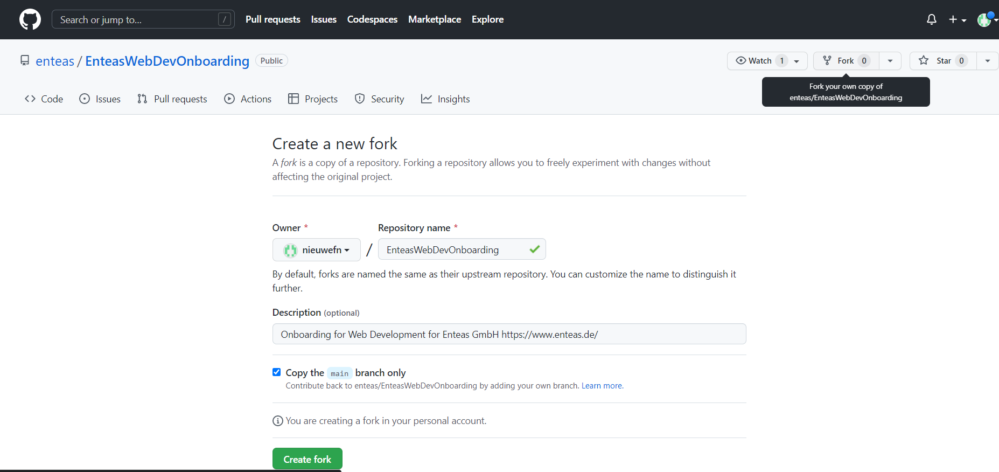
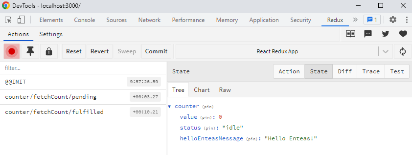

# Enteas Web Development Onboarding
Onboarding for Web Development for Enteas GmbH https://www.enteas.de/

## Table of Contents
- [Introduction](#introduction)
    - [Goals](#goals)   
- [Installation Guide](#installation-guide)
- [Development Guide](#development-guide)
    - [Initial Setup](#initial-setup)
    - [Basic Backend Setup](#basic-backend-setup)
    - [Basic Frontend Setup](#basic-frontend-setup)
- [Project Ideas](#project-ideas)
- [Reading Material](#reading-material)
    - [React](#react)
    - [Redux](#redux)
    - [Node Express](#node-express)
    - [Data Fetching](#data-fetching)
    - [Git](#git)
    - [Eslint](#eslint)
    - [Couchbase](#couchbase)
    - [AG Grid](#ag-grid)
    - [Swagger/OpenAPI Spec 3.0](#swagger)
- [Feedback](#feedback)


## Introduction
This is a guide for onboarding new developers to the Enteas Web Development Team. Working on this guide will help you get familiar with the tools and technologies we use at Enteas. This guide is a work in progress, so please write down and notify us about any uncertainties or problems you encounter.

### Goals
- Become familiar with the tools and technologies we use at Enteas
- Become familiar with the development process at Enteas
- Create a React.JS frontend application communication with a Node.JS Express backend
- Working on this guide will ease your entry with working on future Enteas projects and will allow you to take on more interesting and exciting tasks early on during your internship

## Installation Guide
Install Visual Studio Code https://code.visualstudio.com/download

1. Inside VSCode install the following extensions:
    - ESLint
2. Install Node.js, preferably using Node Version Manager (NVM)
    - Windows NVM Install: https://github.com/coreybutler/nvm-windows/releases
    - Install the latest LTS Version of Node.js
3. Chrome Browser
    - Comes with Chrome Devtools
    - Install "Redux Devtools" as a Chrome Extension
4. Install Git
    - Windows: https://git-scm.com/download/win
    - Default installation, no need to change anything, can use a different Editor (for example, Notepad++)
    - Create a GitHub Account
5. Optional for further development
    - Couchbase
        - https://github.com/couchbase/couchnode
        - https://docs.couchbase.com/server/current/install/install-intro.html
        - "npm install couchbase"

## Development Guide
### Initial Setup
Fork this Git repository to create your own copy of the repository. This will allow you to make changes to the repository without affecting the original repository.


Clone your forked repository to your local machine. This will create a local copy of the repository on your machine. If you need more information on how to clone a repository, please refer to the [Git](#git) section.

While working at Enteas, most of your changes will be merged using Pull-Requests from your working branch. This will allow us to review your changes before merging them into the main branch. To understand the Pull-Request process, we suggest you create a new branch before committing and pushing your first changes. This will allow you to create a Pull-Request from your new branch to the main branch. You can then merge the Pull Request yourself via GitHub.

### Basic Backend Setup
Open the cloned git project in a command prompt or terminal. Run the following commands to initiate the backend project:

1. `npm install -g express-generator`
2. `express --no-view --git nameOfYourProject-be`

You can name the project however you like, but we suggest using the following naming convention: `nameOfYourProject-be` for the backend and `nameOfYourProject-fe` for the frontend.

Open the newly created folder in VSCode. Open the terminal inside of VSCode and run the following commands:
1. `npm install`
2. `npm install cors`
3. `npm run start`

By default, your Express server will be running on port 3000, reachable by opening http://localhost:3000 in your browser. 

As your frontend will also be running on port 3000 by default, you need to change one of the ports. Inside of your BE project, open the bin/www file and change the line containing `var port = normalizePort(process.env.PORT || '3000')` to `var port = normalizePort(process.env.PORT || '3001')`. This will change the port to 3001.

#### Basic BE Development
Create a "src" folder in the top level of your backend project. Inside this folder, your newly written source-code should be saved. The following section will describe a minimal setup for creating a new API endpoint.

Inside the src folder, create a new file called "helloEnteas.js".
The file should contain the following code:
``` javascript
const helloEnteas = (app) => {
    const apiName = '/getHelloEnteas';
    app.get(apiName, (req, res) => {
        res.status(200);
        res.json({ success: true, message: 'Hello Enteas!'})
    });
}
module.exports.helloEnteas = helloEnteas;
```

Inside your app.js file, import the newly created file and call the function with the app as a parameter. Your app.js file should now look like this:
``` javascript
			var express = require('express');
			var path = require('path');
			var cookieParser = require('cookie-parser');
			var logger = require('morgan');
			var indexRouter = require('./routes/index');
			var usersRouter = require('./routes/users');
			var app = express();
			var helloEnteas = require('./src/helloEnteas').helloEnteas;
			app.use(logger('dev'));
			app.use(express.json());
			app.use(express.urlencoded({ extended: false }));
			app.use(cookieParser());
			app.use(express.static(path.join(__dirname, 'public')));
      			app.use(cors());
			app.use('/', indexRouter);
			app.use('/users', usersRouter);
			helloEnteas(app);
			module.exports = app;
```

This is only an explanation of how to expose an API endpoint. You can write all your future APIs the same way.
This guide will only provide examples of what sort of endpoints you could write. Which endpoints you write and how complicated they are, are up to you. For some examples of what you could do, see [Project Ideas](#project-ideas)


### Basic Frontend Setup
Open the cloned git project in a command prompt or terminal. Run the following commands to initiate the frontend project:
`npx create-react-app nameOfYourProject-fe --template redux`

Open the newly created project using VSCode. Open the terminal inside of VSCode and run: `npm run start`. You do not need to run `npm install` as the create-react-app command already does this. You can view your running React FE project by opening http://localhost:3000 in your browser.

The project is initiated with a basic Redux counter example. To understand redux and how to use it, we suggest that you read the [Redux](#redux) section. Especially "Redux Toolkit" is an essential part of our development.

In order to access our "HelloEnteas" GET Request, we will modify and extend the code from the counter example. Two steps are necessary, we need to fetch the data from our backend, and we need a place to trigger the function from the frontend. 
To fetch the data, navigate to features/counter/counterAPI.js and add following function to the end of the file: 
``` javascript
export function getHelloEnteas() {
  return new Promise((resolve) => {
    //fetch data from express backend
    const url = 'http://localhost:3001/getHelloEnteas';
    fetch(url, {
      method: 'GET',
      headers: {
        'Content-Type': 'application/json',
      },
    })
      .then((response) => response.json())
      .then((data) => {
        console.log('data', data);
        resolve(data);
      });
  });
}
```

Now we have to call this function from the frontend. To achieve this, we will modify the action of the "incrementAsync" function provided by the create-react-app counter example. Open features/counter/counterSlice.js. We have to perform small changes at different parts in the file. Locate the `const initialState` object and add `helloEnteasMessage: ''` to the end of the object. It should now look like this:
``` javascript
const initialState = {
  value: 0,
  status: 'idle',
  helloEnteasMessage: ''
};
```

Next, we replace the function called inside incrementAsync to call our getHelloEnteas function. To achieve this, we need to import the getHelloEnteas function from the counterAPI and modify `import { fetchCount } from './counterAPI';` to `import { getHelloEnteas } from './counterAPI';`

Your incrementAsync function should now look like this:
``` javascript
export const incrementAsync = createAsyncThunk(
  'counter/fetchCount',
  async (amount) => {
    const response = await getHelloEnteas();
    // The value we return becomes the `fulfilled` action payload
    return response.message;
  }
);
```
Note how the return was modified from `response.data` to `response.message` since our helloEnteas API in the BE returns an object containing a success boolean and a message string. For this example, we are only interested in the message string.

Finally, we need to modify the reducer (`extraReducers` in counterSlice.js) to save the message string in the state. Modify the extraReducers function to look like this:
``` javascript
extraReducers: (builder) => {
    builder
      .addCase(incrementAsync.pending, (state) => {
        state.status = 'loading';
      })
      .addCase(incrementAsync.fulfilled, (state, action) => {
        state.status = 'idle';
        state.helloEnteasMessage = action.payload;
      });
  },
```
Instead of modifying the state.value variable, we save our payload, returned from our createAsyncThunk in the helloEnteasMessage state variable. 

Once you have completed all of this your message from the backend will be stored in the redux store. You can view your current redux store by opening the Chrome Devtools and switching to the "Redux" tab (you need to have installed the Redux DevTools). Here, the current state is shown. 


If you would like to display your message in the frontend, look at how the count is displayed in features/counter/Counter.js using the `useSelector(selectCount)` logic. You can use the same logic to display your message by writing a new selector in the counterSlice.

## Project Ideas
As this guide aims to improve your understanding of Web development using the technology stack we use at Enteas, there is no strict specification of what you have to implement. If you have an exciting idea you want to create in a web app, you should do so.

In case you are not sure what you want to do, here is an example:
 - Create a web page that allows you to enter information about yourself. This information should be saved in a couchbase database. You should be able to create, read, update and delete (CRUD) the data. This would mean you would require a form in the frontend where you can enter the necessary information about a person. You would need API endpoints to which you can transfer the information entered in the frontend. Each endpoint then saves/edits/deletes the data in a couchbase database. For more information about working with couchbase, see [Couchbase](#couchbase). We use couchbase in many of our projects, so learning about couchbase early will help you a lot. 
 Every person you created could be displayed in a table. To create a table, be sure to use [AG-Grid](#ag-grid), as we frequently utilize this library.

## Reading Material

### React
- https://reactjs.org/tutorial/tutorial.html

### Redux
- https://redux.js.org/tutorials/essentials/part-1-overview-concepts
- https://redux-toolkit.js.org/tutorials/overview
- https://redux-toolkit.js.org/rtk-query/overview

### Node Express
- https://developer.mozilla.org/en-US/docs/Learn/Server-side/Express_Nodejs/Introduction

### Data Fetching
- https://blog.logrocket.com/modern-api-data-fetching-methods-react/


### Git
- EN: https://rogerdudler.github.io/git-guide/
- DE: https://rogerdudler.github.io/git-guide/index.de.html

### Eslint
- https://eslint.org/
- https://eslint.org/docs/latest/use/getting-started

### Couchbase
- https://docs.couchbase.com/server/current/install/install-intro.html
- https://docs.couchbase.com/nodejs-sdk/3.0/hello-world/start-using-sdk.html
- https://github.com/couchbase/couchnode


### AG Grid
- https://www.ag-grid.com/react-data-grid/getting-started/

### Swagger
- https://swagger.io/specification/


## Feedback
As this onboarding guide's purpose is to aid new interns in becoming accustomed to the web development stack we often use at Enteas, it would be very beneficial if you could provide feedback regarding this guide. Which points were wrong, and where more explanation/information is necessary. You know how to contact us; just send us an E-Mail with open questions and improvements. We will try to incorporate these improvements and open questions into this guide. 
